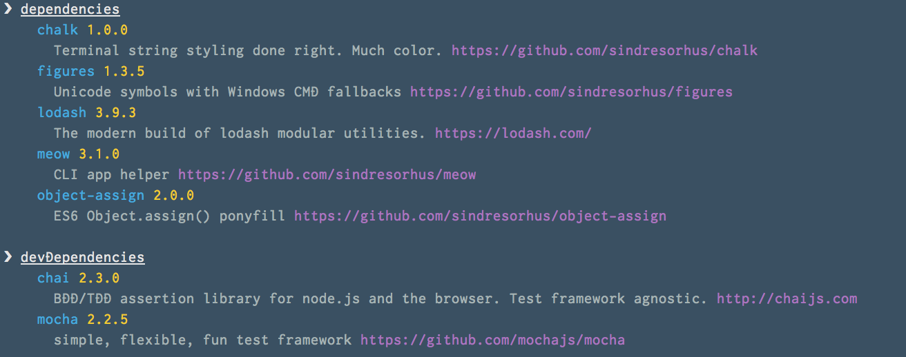

# Depen

[](https://github.com/makotot/depen)
[](https://github.com/makotot/depen)
[](https://github.com/makotot/depen)
[](https://github.com/makotot/depen)
[](https://github.com/makotot/depen)

> Get the infomation of dependencies in the project.



## Install

```sh
$ npm i --save depen
```
or
```sh
$ npm i -g depen
```

## Usage

```js
var depen = require('depen');

depen('./', function (err, dependencies) {
  if (err) {
    throw err;
  }

  console.log(dependencies);
});
```

## CLI

```sh
$ depen [target project]
```


## License

MIT
